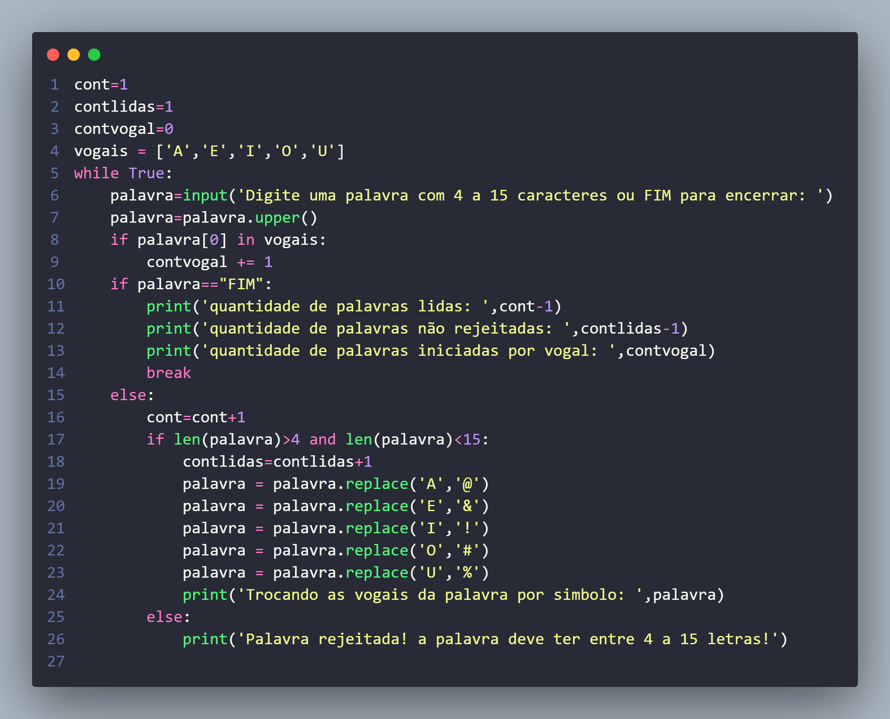

# exercicio-python-faculdade
## Exercício de Lógica de Programação com Python
1) Escreva um programa que leia palavras, até que a palavra “fim” (com qualquer grafia) seja digitada.
As palavras menores que 4 caracteres ou maiores do que 15 caracteres devem ser rejeitadas.
Para as palavras aceitas troque as vogais : a,e,i,o ,u respectivamente por @,&,!,#,%, mostrando a palavra depois das trocas.
Conte as palavras iniciadas por vogal.
No final mostre: o total de palavras lidas, o total de palavras não rejeitadas e o total de palavras que iniciaram por vogal

## Resolução

